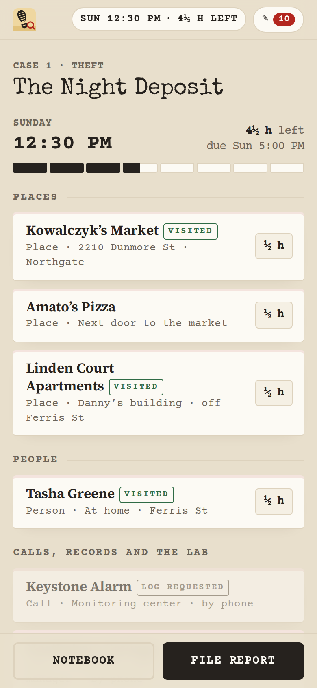
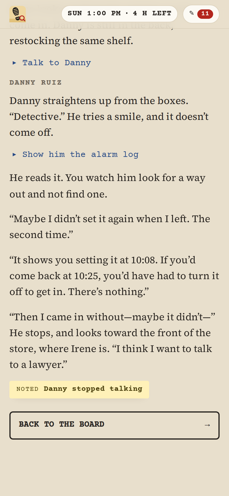
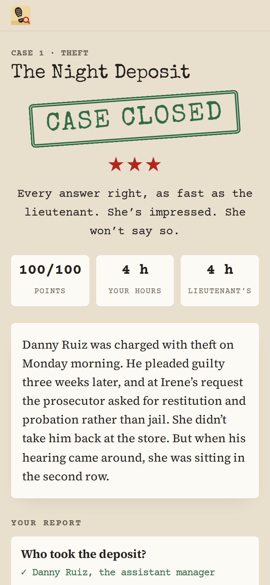
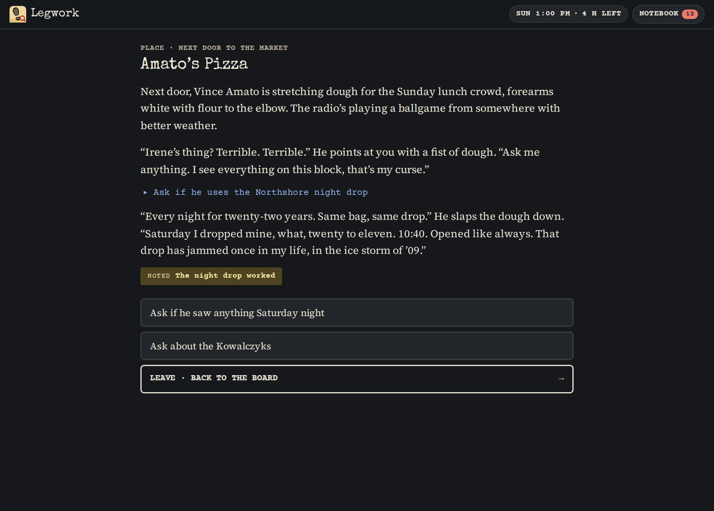

# Legwork

**Play it: [junkdrawer.works/legwork](https://junkdrawer.works/legwork/)**

**A detective casebook.** Six crimes in Port Calder, a Great Lakes city of grain elevators and old money. Only one of them is a murder. Every lead costs hours you don’t have, what you learn opens the next door, and somebody’s story doesn’t match the record. When you can prove it, or when the clock runs out, you file your report.

<p align="center">
  
  &nbsp;
  
  &nbsp;
  
</p>

<p align="center">
  
</p>

## How it works

- **The hours are the game.** Each case gives you a working budget, usually a day or a day and a half, before Lieutenant Okafor wants a name. Every lead shows what it costs: half an hour for a phone call, an hour to drive across town, more to dig through a basement of files. You’ll never have time for everything, so the question is always what’s worth the time.
- **What you learn opens doors.** A name in one interview becomes a place to go. A fact you find becomes a question you can put to someone else, so go back to them when you’ve got something new. Show a suspect the log that contradicts them and watch the story change.
- **Records and the lab take time.** Send the request early, and the answer turns up in your inbox a few hours later while you work other leads. Some things happen on their own schedule: a witness wakes up, a lawyer stops the interviews, someone files a claim.
- **Your notebook** keeps every clue, a page for each person with what you know about them, a timeline of the night in question built from every time anyone gives you, and a log of your own day.
- **The report** asks who did it, and then the questions a guess won’t get: how, why, where the money went, what proves the alibi false. Afterward you see what really happened, which clues proved it (and which you missed), and the lieutenant’s shorter route next to yours.
- **The cases**
  1. **The Night Deposit** · theft · a grocery’s Saturday takings never reach the bank, and the safe wasn’t forced
  2. **The Shared Wall** · arson · a hardware store burns, and its broke owner looks guilty
  3. **Harbor Road** · hit-and-run · a nurse cycling home from the night shift, and a councilman’s family with a story ready
  4. **Power of Attorney** · missing person · an 81-year-old chemistry teacher, gone nine days, and a nephew who says he’s fine
  5. **The Heron** · art theft · a painting cut from its frame during the donors’ dinner
  6. **Low Water** · homicide · a charter captain found drowned beside his boat, in the wrong kind of water
- No account and no server. Progress is saved in your browser. It works offline and installs to a phone’s home screen.

## Running it

It’s a static site: plain HTML, CSS and JavaScript modules, with no build step.

```sh
npx serve .                          # or any static file server, then open the printed address
npm test                             # the engine, plus every case checked and played by its solution route (Node 20+)
node test/e2e.mjs                    # plays every case in Chromium through the real page (needs Playwright)
node tools/check-case.mjs js/cases/night-deposit.js   # one case: problems, hours, word count, 200 random players
node tools/screenshots.mjs           # redraws docs/*.png and og.png
node tools/make-icons.mjs            # redraws the PNG icons from icon.svg
```

To put it online with GitHub Pages: **Settings → Pages → Build and deployment → Deploy from a branch**, then pick the branch and `/ (root)`.

### Files

- `js/cases/*.js`: the cases, one file each, as plain data: people, clues, leads, scenes and choices, timed events, the report and the solution. **[docs/WRITING.md](docs/WRITING.md)** explains the format, the city and the recurring cast, and how to write a fair case.
- `js/engine.js`: the rules, with no DOM: conditions like `alarm_log & !danny_lawyer`, the working-hours clock, visiting leads, choices, timers and events, grading, and walking a route.
- `js/check.js`: catches mistakes in a case, such as a clue nobody can find, a lead with no scene, a condition naming something that doesn’t exist, or a solution that can’t be reached in the hours given.
- `js/app.js`: the pages. `js/text.js` turns case text into HTML, and `js/store.js` saves and restores.
- `fonts/`: Source Serif 4 and Courier Prime (SIL Open Font License) and Special Elite (Apache License 2.0), served from here so nothing loads from elsewhere.

Port Calder and everyone in it are made up.
