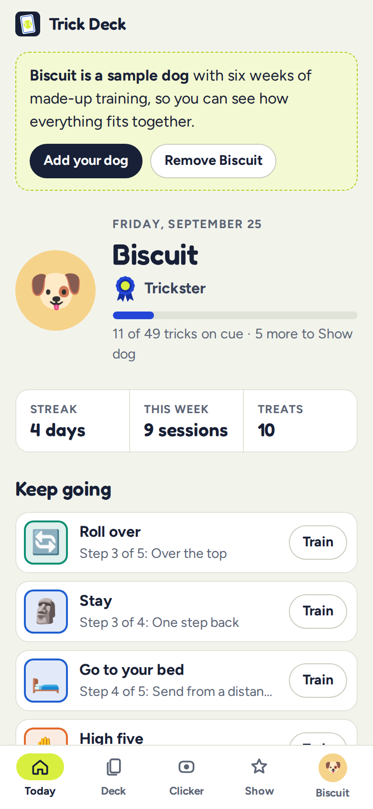
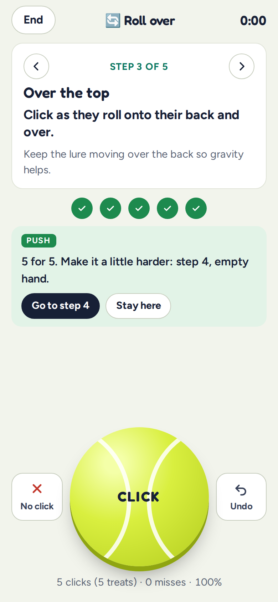
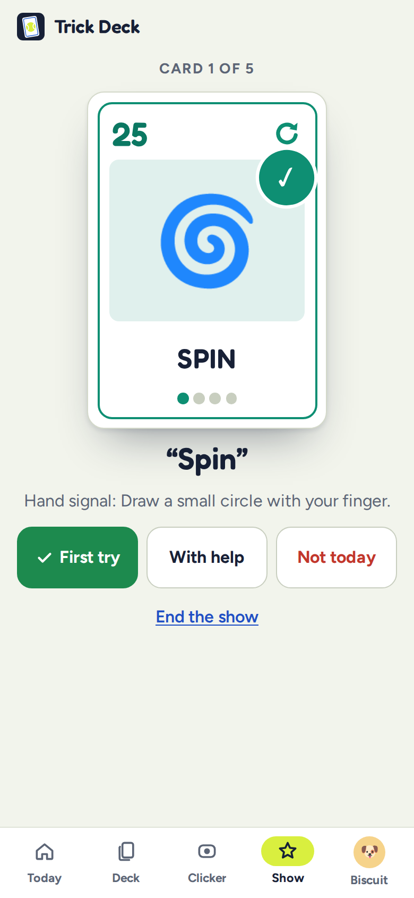
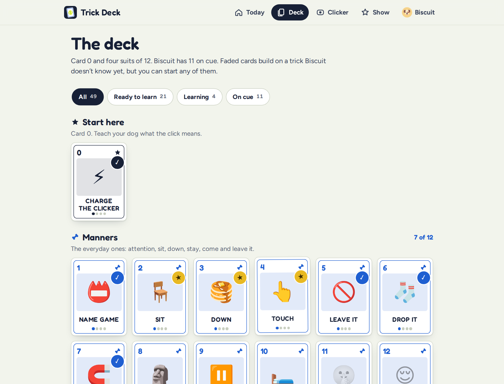

# Trick Deck

**Use it: [junkdrawer.works/trick-deck](https://junkdrawer.works/trick-deck/)**

**Teach your dog a new trick, five tries at a time.** Trick Deck is a clicker, a coach and a scorecard in your pocket. It has 48 tricks with step-by-step plans, a coach that tells you when to move on, and a trick show that deals from the tricks your dog knows.

<p align="center">
  
  &nbsp;
  
  &nbsp;
  
</p>

<p align="center">
  
</p>

<sub>Screenshots use Biscuit, the sample dog with six weeks of made-up training.</sub>

## How it works

Clicker training marks the exact moment your dog gets something right. The click says “yes, that!”, and a treat follows. Trick Deck turns your phone into the clicker and keeps count while you train.

- **The clicker is a tennis ball.** Tap it the moment you see the behavior. It sounds on touch-down, not on release, so your timing is what the dog hears. The box clicker even makes the second “clack” when you let go, like the real thing. There are soft, tongue-click and chirp sounds for noise-shy dogs or noisy parks, and a silent mode if you'd rather use your own clicker and let the app count.
- **Push, drop, stick.** Trainers work in sets of five tries. Tap the ball for a click and **No click** for a miss. After five, the coach decides: 5 of 5 means push on to the next step, 2 or fewer means drop back a step, and anything in between means stick. The rule comes from trainer Jean Donaldson, and it stops you from asking for too much too soon.
- **Every step says exactly what to click.** “Click the moment their bottom touches the floor.” “Click the head dipping between the paws.” The step also says how to set it up.
- **48 tricks in four suits of 12**, like a Spanish deck: Manners, Poses & paws, Moves, and Helpers & games. Card 0, Charge the clicker, comes first. Each card has a lure, shape, capture or target method, a cue word and a hand signal, what to do when it's not working, and cautions where they matter. Examples: no jumping before growth plates close, and no Sit pretty for long-backed breeds without asking your vet.
- **Prerequisites, but no locks.** Roll over builds on Down, Leg weave on Middle, Put your toys away on Fetch. Cards whose prerequisites aren't known yet show faded, but you can start any card.
- **On cue, then solid.** Finish the last step and the card is stamped into your dog's deck. Proof it in new places, around distractions and from a distance, and it gets a gold star.
- **Trick show.** Shuffle the cards your dog knows and deal. The phone can call each card out loud. Give the cue once, then tap First try, With help or Not today. It's a party trick, and it also measures which tricks are reliable: the show page lists first-try rates for the last ten calls, weakest first.
- **Titles.** New recruit, Good dog, Quick study, Clever dog, Trickster, Show dog, Headliner, Star of the show, and Legend for the whole deck.
- **Treat math.** Training treats count toward the day's food. Add your dog's weight and life stage, and Trick Deck works out daily calories (70 × kg<sup>0.75</sup> × a life-stage factor) and keeps treats under the usual 10% allowance. If you train with kibble from their meals, there's nothing extra to count.
- **Short sessions.** A session timer nudges you at three minutes and again at five. The screen stays on while you train, where the browser allows it.
- **History.** Streaks, a 12-week calendar of training days, and a log of every session.
- **More than one dog**, each with their own deck.
- No account and no server. Everything stays in your browser. You can save a backup file and restore it on another phone. It works offline and installs to a phone's home screen.

## Running it

It's a static site: plain HTML, CSS and JavaScript modules, with no build step.

```sh
npx serve .                   # or any static file server, then open the printed address
npm test                      # the coach, the calorie math, and checks on every card (Node 20+)
node test/e2e.mjs             # drives the real page in Chromium from first visit to a trick show (needs Playwright)
node tools/screenshots.mjs    # redraws docs/*.png and og.png from the sample dog
node tools/make-icons.mjs     # redraws the PNG icons from icon.svg
```

To put it online with GitHub Pages: **Settings → Pages → Build and deployment → Deploy from a branch**, then pick the branch and `/ (root)`.

### Files

- `js/tricks.js`: the deck. Each trick has its suit, level, method, cue, steps and fixes. Adding a trick means adding an entry here; `npm test` checks that it's complete.
- `js/coach.js`: pure functions for push/drop/stick, what to learn next, titles, proofing, streaks, the calendar and treat calories.
- `js/clicker.js`: the clicker sounds, made with Web Audio so they play the instant you touch the screen.
- `js/app.js`: routing and most pages. `js/train.js` has the training screen and the free clicker, and `js/show.js` has the trick show.
- `js/ui.js`: the card face, avatars and small shared pieces. `js/store.js` saves and restores. `js/sample.js` makes Biscuit.
- `fonts/`: Fredoka and Figtree, both under the SIL Open Font License, served from here so nothing loads from elsewhere.

Trick Deck is for tricks and manners. If a dog is fearful, aggressive or suddenly behaving differently, talk to a vet and a certified trainer or veterinary behaviorist.
